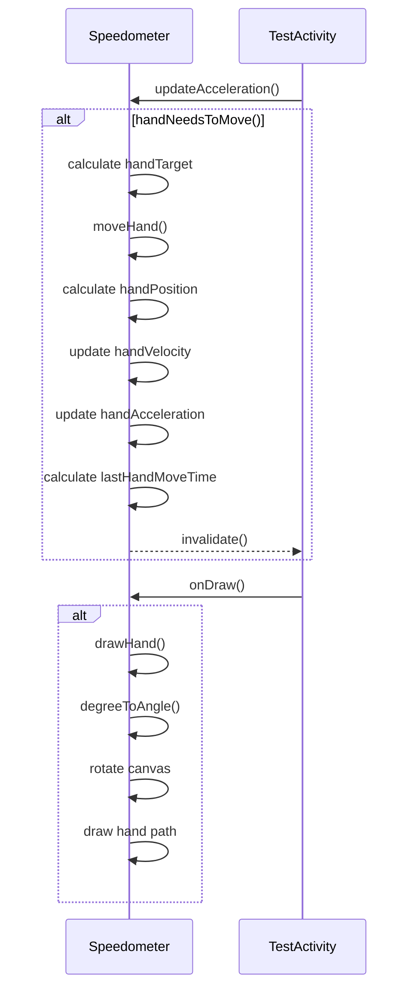

```mermaid
sequenceDiagram
    participant S as Speedometer
    participant T as TestActivity
    
    T->>S: updateAcceleration()
    alt handNeedsToMove()
        S->>S: calculate handTarget
        S->>S: moveHand()
        S->>S: calculate handPosition
        S->>S: update handVelocity
        S->>S: update handAcceleration
        S->>S: calculate lastHandMoveTime
        S-->>T: invalidate()
    end

    T->>S: onDraw()
    alt
        S->>S: drawHand()
        S->>S: degreeToAngle()
        S->>S: rotate canvas
        S->>S: draw hand path
    end
```