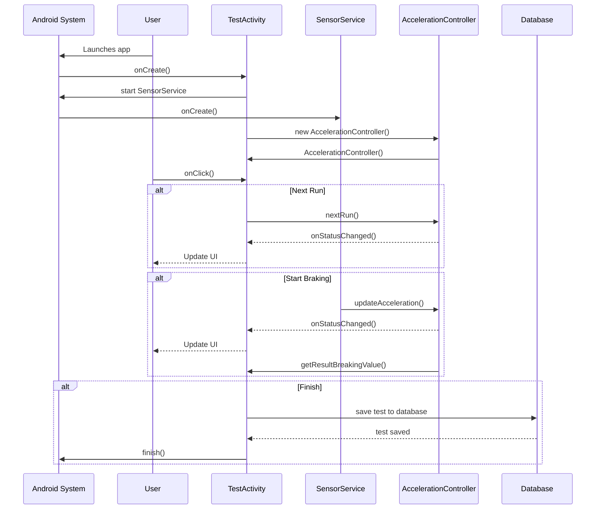

# Your Role
- Expert Java Developer

# Your Task
- Rewrite that last diagram using this one as an example.

# Exemplar

```mermaid
sequenceDiagram
    participant A as Android System
    participant U as User
    participant T as TestActivity
    participant S as SensorService
    participant C as AccelerationController
    participant D as Database
    
    U->>A: Launches app
    A->>T: onCreate()
    T->>A: start SensorService
    A->>S: onCreate()
    
    T->>C: new AccelerationController()
    C->>T: AccelerationController()
    
    U->>T: onClick()
    alt Next Run
    T->>C: nextRun()
    C-->>T: onStatusChanged()
    T-->>U: Update UI
    end
    
    alt Start Braking
    S->>C: updateAcceleration()
    C-->>T: onStatusChanged()
    T-->>U: Update UI
    C->>T: getResultBreakingValue() 
    end
    
    alt Finish
    T->>D: save test to database 
    D-->>T: test saved
    T->>A: finish()
    end
```