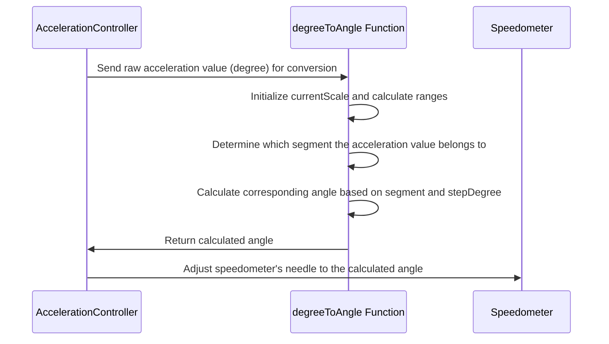
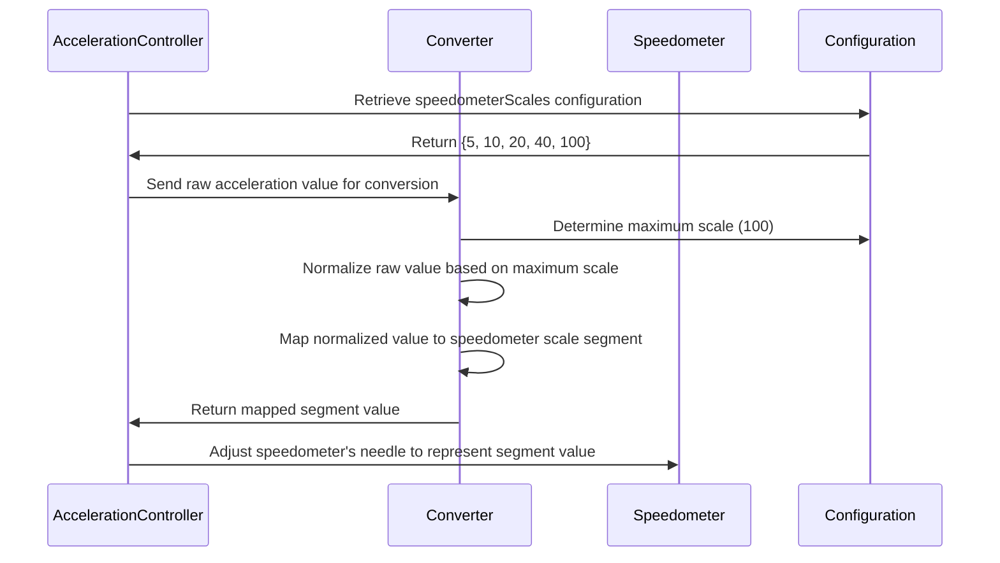
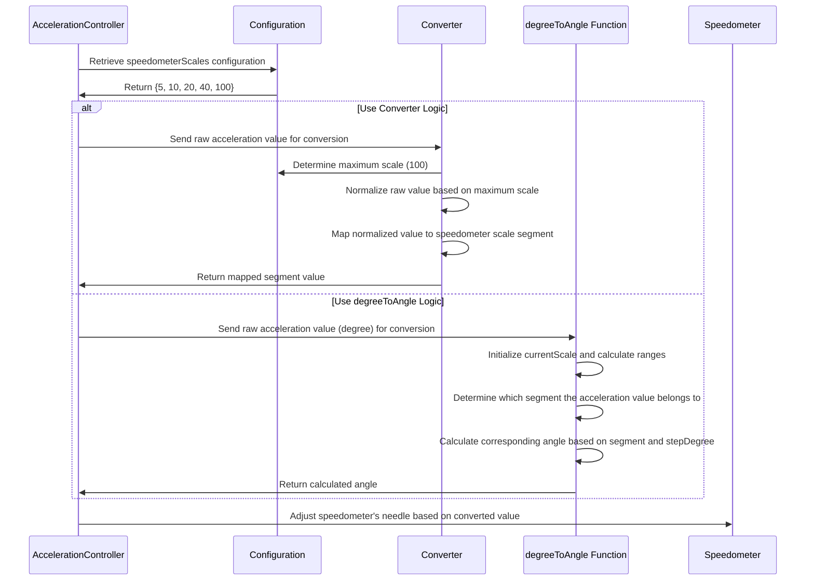

Good job.  Thank you.

Would combining the two diagrams into one make sense and be helpful?

# Combined

```mermaid
sequenceDiagram
    participant AC as AccelerationController
    participant DTA as degreeToAngle Function
    participant S as Speedometer

    AC->>DTA: Send raw acceleration value (degree) for conversion
    DTA->>DTA: Initialize currentScale and calculate ranges
    DTA->>DTA: Determine which segment the acceleration value belongs to
    DTA->>DTA: Calculate corresponding angle based on segment and stepDegree
    DTA->>AC: Return calculated angle
    AC->>S: Adjust speedometer's needle to the calculated angle
```

```mermaid
sequenceDiagram
    participant AC as AccelerationController
    participant C as Converter
    participant S as Speedometer
    participant Config as Configuration

    AC->>Config: Retrieve speedometerScales configuration
    Config->>AC: Return {5, 10, 20, 40, 100}
    AC->>C: Send raw acceleration value for conversion
    C->>Config: Determine maximum scale (100)
    C->>C: Normalize raw value based on maximum scale
    C->>C: Map normalized value to speedometer scale segment
    C->>AC: Return mapped segment value
    AC->>S: Adjust speedometer's needle to represent segment value
```

```mermaid
sequenceDiagram
    participant AC as AccelerationController
    participant Config as Configuration
    participant C as Converter
    participant DTA as degreeToAngle Function
    participant S as Speedometer

    AC->>Config: Retrieve speedometerScales configuration
    Config->>AC: Return {5, 10, 20, 40, 100}

    alt Use Converter Logic
        AC->>C: Send raw acceleration value for conversion
        C->>Config: Determine maximum scale (100)
        C->>C: Normalize raw value based on maximum scale
        C->>C: Map normalized value to speedometer scale segment
        C->>AC: Return mapped segment value
    else Use degreeToAngle Logic
        AC->>DTA: Send raw acceleration value (degree) for conversion
        DTA->>DTA: Initialize currentScale and calculate ranges
        DTA->>DTA: Determine which segment the acceleration value belongs to
        DTA->>DTA: Calculate corresponding angle based on segment and stepDegree
        DTA->>AC: Return calculated angle
    end

    AC->>S: Adjust speedometer's needle based on converted value
```