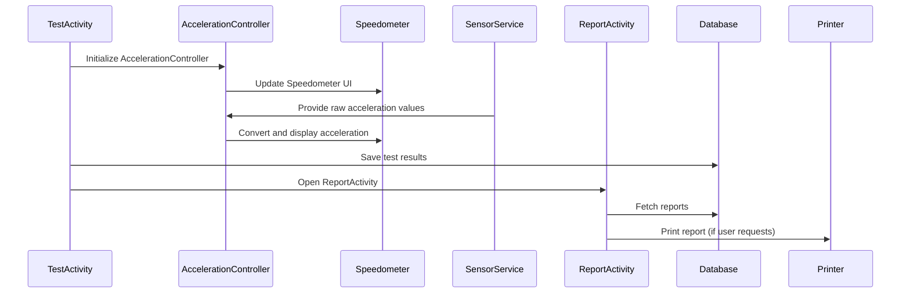

```mermaid
sequenceDiagram
    participant TA as TestActivity
    participant AC as AccelerationController
    participant S as Speedometer
    participant SS as SensorService
    participant RA as ReportActivity
    participant DB as Database
    participant P as Printer

    TA->>AC: Initialize AccelerationController
    AC->>S: Update Speedometer UI
    SS->>AC: Provide raw acceleration values
    AC->>S: Convert and display acceleration
    TA->>DB: Save test results
    TA->>RA: Open ReportActivity
    RA->>DB: Fetch reports
    RA->>P: Print report (if user requests)
```

###
### g4_conversation 
https://chat.openai.com/share/e2794553-212e-4d02-ad00-2b314ca426e8
