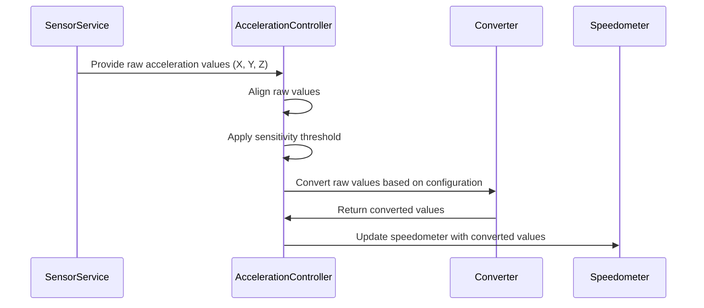

```mermaid
sequenceDiagram
    participant SS as SensorService
    participant AC as AccelerationController
    participant C as Converter
    participant S as Speedometer

    SS->>AC: Provide raw acceleration values (X, Y, Z)
    AC->>AC: Align raw values
    AC->>AC: Apply sensitivity threshold
    AC->>C: Convert raw values based on configuration
    C->>AC: Return converted values
    AC->>S: Update speedometer with converted values
```
