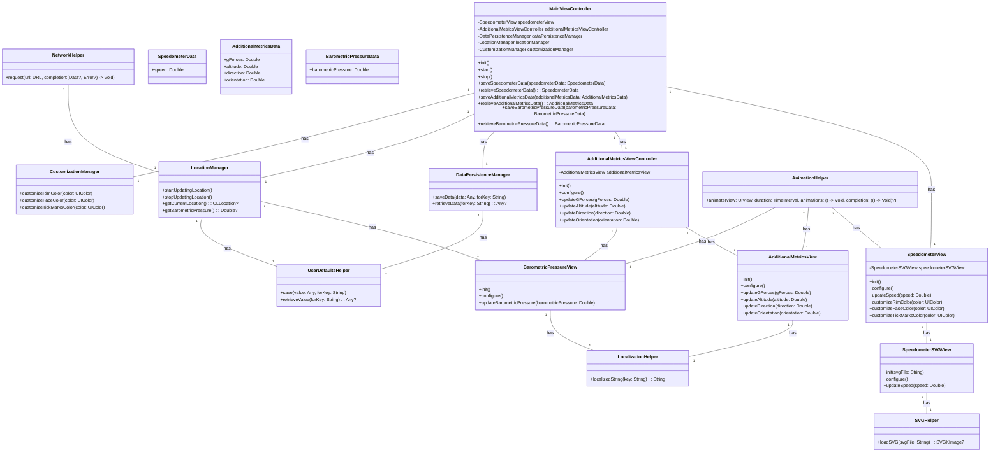
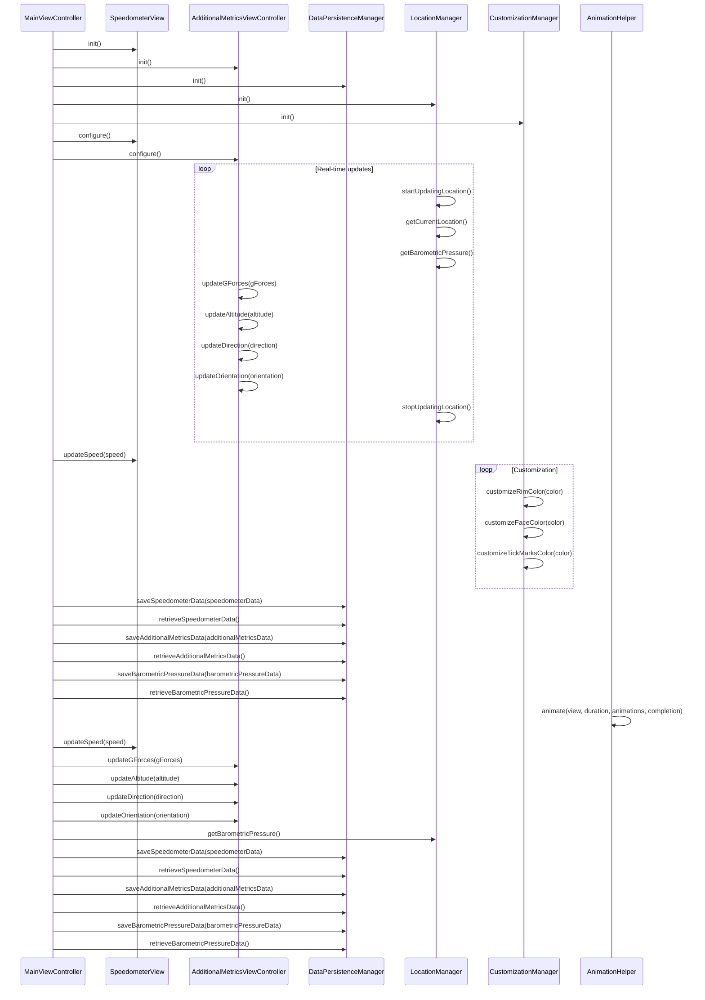

# Context
Architect: ## Implementation approach

To implement the airplane speedometer gauge iOS application, we will follow the following approach:

1. **UI Design**: We will design a clean and intuitive user interface that displays the speedometer gauge with customizable visual elements such as the rim, face, and tick marks. We will also design separate screens to display additional aviation metrics such as G-forces, altitude, direction, and orientation.

2. **Core Animation**: To achieve smooth visual transitions, we will utilize the Core Animation framework provided by Apple. This framework provides powerful animation capabilities that can be used to create smooth and visually appealing transitions between different screens and visual elements.

3. **Sensor Integration**: We will integrate various sensors to measure and display additional aviation metrics. For this purpose, we will use the Core Motion framework provided by Apple. This framework allows us to access data from the device's accelerometer, gyroscope, and magnetometer to measure G-forces, orientation, and direction.

4. **Customization**: To implement customizable visual elements for the speedometer, we will use open-source libraries such as SwiftSVG and SVGKit. These libraries allow us to create and manipulate scalable vector graphics (SVG) that can be used to customize the appearance of the speedometer gauge.

5. **Data Persistence**: To implement the functionality to save and retrieve gauge metrics, we will use the Core Data framework provided by Apple. Core Data is a powerful and efficient framework for managing the persistence of data in iOS applications.

6. **Barometric Pressure Readings**: To provide real-time barometric pressure readings and warnings about potential turbulent areas, we will use the Core Location framework provided by Apple. This framework allows us to access the device's GPS and barometer to obtain real-time location and barometric pressure data.

## Swift Package Name
```swift
"AirplaneSpeedometer"
```

## File List
```swift
[
    "MainViewController.swift",
    "SpeedometerView.swift",
    "AdditionalMetricsViewController.swift",
    "DataPersistenceManager.swift",
    "LocationManager.swift",
    "CustomizationManager.swift",
    "Models/SpeedometerData.swift",
    "Models/AdditionalMetricsData.swift",
    "Models/BarometricPressureData.swift",
    "Views/SpeedometerSVGView.swift",
    "Views/AdditionalMetricsView.swift",
    "Views/BarometricPressureView.swift",
    "Helpers/AnimationHelper.swift",
    "Helpers/SVGHelper.swift",
    "Helpers/LocalizationHelper.swift",
    "Helpers/NetworkHelper.swift",
    "Helpers/UserDefaultsHelper.swift"
]
```

## Data Structures and Interface Definitions


## Program Call Flow


## Anything Unclear

## Format example

---
## Required Swift third-party packages
```swift
"""
flask==1.1.2
bcrypt==3.2.0
"""
```

## Required Other language third-party packages
```swift
"""
No third-party ...
"""
```

## Full API spec
```swift
"""
openapi: 3.0.0
...
description: A JSON object ...
"""
```

## Logic Analysis
```swift
[
    ("game.swift", "Contains ..."),
]
```

## Task list
```swift
[
    "game.swift",
]
```

## Shared Knowledge
```swift
"""
'game.swift' contains ...
"""
```

## Anything Unclear
We need ... how to start.
---

-----
Role: You are a project manager; the goal is to break down tasks according to PRD/technical design, give a task list, and analyze task dependencies to start with the prerequisite modules
Requirements: Based on the context, fill in the following missing information, note that all sections are returned in Swift code triple quote form seperatedly. Here the granularity of the task is a file, if there are any missing files, you can supplement them
Attention: Use '##' to split sections, not '#', and '## <SECTION_NAME>' SHOULD WRITE BEFORE the code and triple quote.

## Required Swift third-party packages: Provided in requirements.txt format

## Required Other language third-party packages: Provided in requirements.txt format

## Full API spec: Use OpenAPI 3.0. Describe all APIs that may be used by both frontend and backend.

## Logic Analysis: Provided as a Python list[str, str]. the first is filename, the second is class/method/function should be implemented in this file. Analyze the dependencies between the files, which work should be done first

## Task list: Provided as Python list[str]. Each str is a filename, the more at the beginning, the more it is a prerequisite dependency, should be done first

## Shared Knowledge: Anything that should be public like utils' functions, config's variables details that should make clear first. 

## Anything Unclear Provide as Plain text. Make clear here. For example, don't forget a main entry. don't forget to init 3rd party libs.

