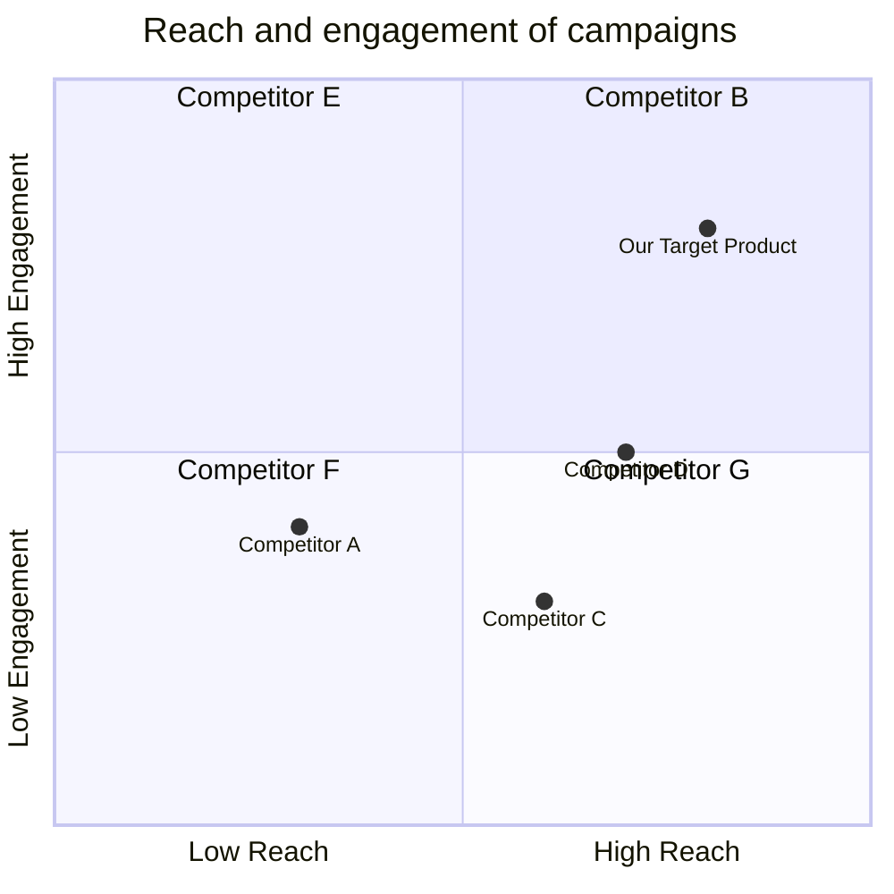
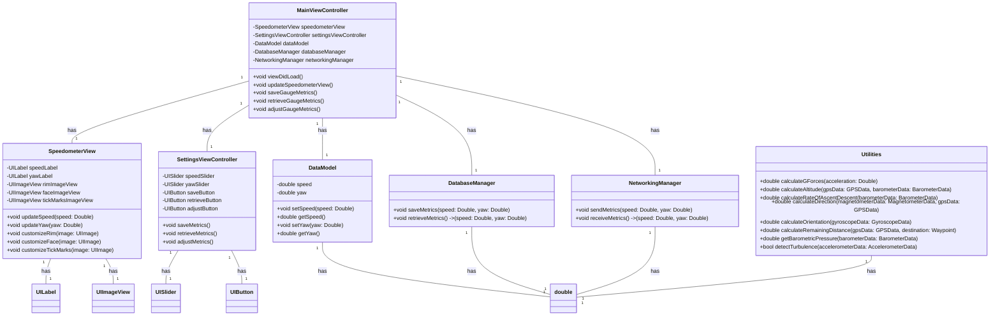
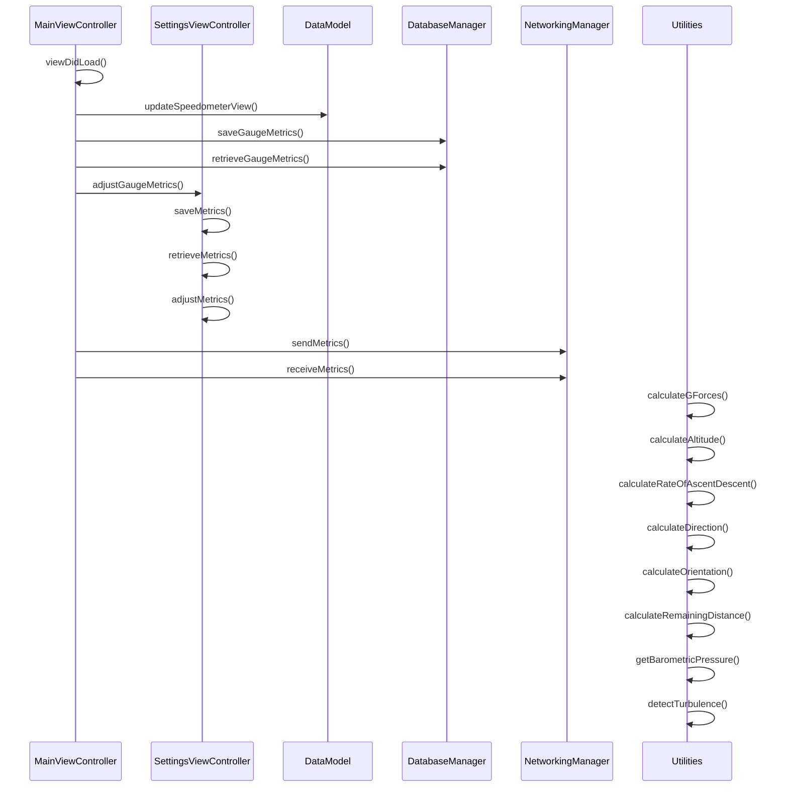

NOTICE
Role: You are a professional engineer; the main goal is to write PEP8 compliant, elegant, modular, easy to read and maintain Swift code.
ATTENTION: Use '##' to SPLIT SECTIONS, not '#'. Output format carefully referenced "Format example".

## Code: Utilities.swift Write code with triple quoto, based on the following list and context.
1. Do your best to implement THIS ONLY ONE FILE. ONLY USE EXISTING API. IF NO API, IMPLEMENT IT.
2. Requirement: Based on the context, implement one following code file, note to return only in code form, your code will be part of the entire project, so please implement complete, reliable, reusable code snippets
3. Attention1: If there is any setting, ALWAYS SET A DEFAULT VALUE, ALWAYS USE STRONG TYPE AND EXPLICIT VARIABLE.
4. Attention2: YOU MUST FOLLOW "Data Structures and Interface Definitions". DONT CHANGE ANY DESIGN.
5. Think before writing: What should be implemented and provided in this document?
6. CAREFULLY CHECK THAT YOU DONT MISS ANY NECESSARY CLASS/FUNCTION IN THIS FILE.
7. Do not use public member functions that do not exist in your design.

-----
# Context
[BOSS: # Context
You are tasked with developing an iOS application tailored for both iPad and iPhone devices. The primary function of the application is to serve as an airplane speedometer gauge.

## Instructions:

### Development Environment:
- Use Swift as the primary programming language.
- Utilize UIKit for the main development components.

### Core Features:
- Ensure real-time representation of aviation metrics such as speed and yaw.
- Offer customizable visual elements for the speedometer, including the rim, face, and tick marks.
- Implement smooth visual transitions using Core Animation.

### Data Management:
- Implement functionalities to adjust, save, and retrieve gauge metrics.
- Leverage MySQL for persistent storage of these metrics.

### Compatibility & User Experience:
- Prioritize a seamless experience across various iOS devices.
- Design an intuitive user interface to enhance the user experience.
- Prioritize intuitive user interface design, making it easy for users to understand speed measurements at a glance.
### Integration:
- Provide capabilities to measure and display G-forces experienced by the aircraft using the device's accelerometer.
- Provide capabilities to measure the current altitude of the aircraft above sea level or ground level using the device's GPS and barometer.
- Provide capabilities to display the rate at which the aircraft is ascending or descending using the device's barometer.
- Provide capabilities to show the current direction or bearing of the aircraft using the device's magnetometer and GPS.
- Provide capabilities to show the aircraft's orientation in terms of yaw, pitch, and roll angles using the device's gyroscope.
- Provide capabilities to calculate and display the remaining distance to the set destination or waypoint using the device's GPS.
- Provide capabilities to offer real-time barometric pressure readings using the device's barometer.
- Provide capabilities to detect and warn pilots about potential turbulent areas using the device's accelerometer., Product Manager: ## Original Requirements:

[BOSS: # Context
You are tasked with developing an iOS application tailored for both iPad and iPhone devices. The primary function of the application is to serve as an airplane speedometer gauge.

## Instructions:

### Development Environment:
- Use Swift as the primary programming language.
- Utilize UIKit for the main development components.

### Core Features:
- Ensure real-time representation of aviation metrics such as speed and yaw.
- Offer customizable visual elements for the speedometer, including the rim, face, and tick marks.
- Implement smooth visual transitions using Core Animation.

### Data Management:
- Implement functionalities to adjust, save, and retrieve gauge metrics.
- Leverage MySQL for persistent storage of these metrics.

### Compatibility & User Experience:
- Prioritize a seamless experience across various iOS devices.
- Design an intuitive user interface to enhance the user experience.
- Prioritize intuitive user interface design, making it easy for users to understand speed measurements at a glance.
### Integration:
- Provide capabilities to measure and display G-forces experienced by the aircraft using the device's accelerometer.
- Provide capabilities to measure the current altitude of the aircraft above sea level or ground level using the device's GPS and barometer.
- Provide capabilities to display the rate at which the aircraft is ascending or descending using the device's barometer.
- Provide capabilities to show the current direction or bearing of the aircraft using the device's magnetometer and GPS.
- Provide capabilities to show the aircraft's orientation in terms of yaw, pitch, and roll angles using the device's gyroscope.
- Provide capabilities to calculate and display the remaining distance to the set destination or waypoint using the device's GPS.
- Provide capabilities to offer real-time barometric pressure readings using the device's barometer.
- Provide capabilities to detect and warn pilots about potential turbulent areas using the device's accelerometer.]

## Product Goals:
```python
[
    "Create a highly accurate and reliable airplane speedometer gauge app for iOS devices",
    "Provide customizable visual elements for the speedometer gauge",
    "Integrate various aviation metrics and sensors to enhance the user experience"
]
```

## User Stories:
```python
[
    "As a pilot, I want to have a real-time representation of my airplane's speed and yaw on my iOS device so that I can monitor the performance of my aircraft during flights.",
    "As a pilot, I want to be able to customize the visual elements of the speedometer gauge, such as the rim, face, and tick marks, so that I can personalize the app to my preferences.",
    "As a pilot, I want the app to smoothly transition between different speedometer gauge visuals using Core Animation, so that the user interface feels fluid and responsive.",
    "As a pilot, I want to be able to adjust, save, and retrieve gauge metrics within the app, so that I can easily customize and access the speedometer settings.",
    "As a pilot, I want the app to seamlessly work on various iOS devices, including both iPad and iPhone, so that I can use it on any device I have available."
]
```

## Competitive Analysis:
```python
[
    "Competitor A: Offers a similar airplane speedometer gauge app for iOS devices, but lacks customizable visual elements and integration with aviation metrics.",
    "Competitor B: Provides a speedometer gauge app with customizable visuals, but lacks real-time representation of aviation metrics and smooth visual transitions.",
    "Competitor C: Offers an app with real-time representation of aviation metrics and customizable visuals, but lacks seamless compatibility across iOS devices.",
    "Competitor D: Provides a speedometer gauge app with smooth visual transitions and seamless compatibility across iOS devices, but lacks integration with aviation metrics.",
    "Competitor E: Offers an app with integration of aviation metrics and seamless compatibility across iOS devices, but lacks customizable visual elements for the speedometer gauge.",
    "Competitor F: Provides a speedometer gauge app with customizable visuals and integration with aviation metrics, but lacks real-time representation of aviation metrics.",
    "Competitor G: Offers an app with real-time representation of aviation metrics and seamless compatibility across iOS devices, but lacks customizable visual elements for the speedometer gauge."
]
```

## Competitive Quadrant Chart:


## Requirement Analysis:
The product should be a highly accurate and reliable airplane speedometer gauge app for iOS devices. It should provide customizable visual elements for the speedometer gauge and integrate various aviation metrics and sensors to enhance the user experience. The app should have a seamless experience across different iOS devices and prioritize intuitive user interface design for easy understanding of speed measurements.

## Requirement Pool:
```python
[
    ("Implement real-time representation of aviation metrics such as speed and yaw", "P0"),
    ("Allow customization of visual elements for the speedometer gauge", "P0"),
    ("Integrate various aviation metrics and sensors for enhanced user experience", "P0"),
    ("Ensure seamless compatibility across various iOS devices", "P1"),
    ("Design an intuitive user interface for easy understanding of speed measurements", "P1")
]
```

## UI Design draft:
The app will have a clean and modern design. The main screen will display the speedometer gauge with customizable visual elements such as the rim, face, and tick marks. The gauge will show the real-time speed and yaw of the aircraft. The user will be able to adjust the gauge metrics and save them for future use. The app will also integrate other aviation metrics such as altitude, rate of ascent/descent, direction, orientation, remaining distance to the destination, and barometric pressure readings. The user interface will be intuitive and easy to understand, with clear labels and visual indicators for each metric. The app will provide smooth visual transitions using Core Animation for a fluid and responsive user experience.

## Anything Unclear:
There are no unclear points., Architect: ## Implementation approach
To design a concise, usable, and complete iOS system for the airplane speedometer gauge app, I will follow the following approach:

1. **Development Environment**: I will use Swift as the primary programming language and utilize UIKit for the main development components. This will ensure compatibility and familiarity with iOS development standards.

2. **Core Features**: To ensure real-time representation of aviation metrics such as speed and yaw, I will use the Core Motion framework provided by Apple. This framework provides access to the device's accelerometer, gyroscope, and magnetometer, allowing us to measure and display the required metrics accurately.

   For customizable visual elements of the speedometer gauge, I will leverage the power of Core Graphics. This framework provides the necessary tools to create custom graphics and animations for the gauge's rim, face, and tick marks.

   To implement smooth visual transitions using Core Animation, I will utilize the Core Animation framework. This framework provides high-performance animation capabilities, allowing for fluid transitions between different speedometer gauge visuals.

3. **Data Management**: For adjusting, saving, and retrieving gauge metrics, I will use Core Data, Apple's recommended framework for data persistence in iOS applications. Core Data provides an object-oriented approach to data management and integrates seamlessly with UIKit.

   To leverage MySQL for persistent storage of gauge metrics, I will use an open-source Swift library called MySQLConnector. This library provides a Swift interface to interact with MySQL databases, allowing us to store and retrieve gauge metrics securely.

4. **Compatibility & User Experience**: To ensure a seamless experience across various iOS devices, I will follow Apple's guidelines for adaptive user interfaces. This will involve using Auto Layout and Size Classes to create a responsive layout that adapts to different screen sizes and orientations.

   For an intuitive user interface design, I will utilize the power of UIKit's built-in controls and components. This will include using labels, sliders, and buttons to display and interact with gauge metrics. I will also focus on clear labeling and visual indicators to enhance the user's understanding of speed measurements.

5. **Integration**: To measure and display G-forces experienced by the aircraft using the device's accelerometer, I will utilize the Core Motion framework. This framework provides access to raw accelerometer data, allowing us to calculate and display G-forces accurately.

   To measure the current altitude of the aircraft using the device's GPS and barometer, I will utilize the Core Location framework. This framework provides access to the device's GPS and barometer data, allowing us to calculate and display altitude accurately.

   To display the rate at which the aircraft is ascending or descending using the device's barometer, I will again utilize the Core Location framework. This framework provides access to barometric pressure data, allowing us to calculate and display the rate of ascent or descent accurately.

   To show the current direction or bearing of the aircraft using the device's magnetometer and GPS, I will utilize the Core Location framework. This framework provides access to magnetometer and GPS data, allowing us to calculate and display the direction accurately.

   To show the aircraft's orientation in terms of yaw, pitch, and roll angles using the device's gyroscope, I will utilize the Core Motion framework. This framework provides access to raw gyroscope data, allowing us to calculate and display the orientation accurately.

   To calculate and display the remaining distance to the set destination or waypoint using the device's GPS, I will again utilize the Core Location framework. This framework provides access to GPS data, allowing us to calculate and display the remaining distance accurately.

   To offer real-time barometric pressure readings using the device's barometer, I will utilize the Core Location framework. This framework provides access to barometric pressure data, allowing us to display real-time readings accurately.

   To detect and warn pilots about potential turbulent areas using the device's accelerometer, I will utilize the Core Motion framework. This framework provides access to raw accelerometer data, allowing us to detect sudden changes in acceleration and warn pilots accordingly.

## Swift Package Name
```swift
"AirplaneSpeedometerGauge"
```

## File List
```swift
[
    "MainViewController.swift",
    "SpeedometerView.swift",
    "SettingsViewController.swift",
    "DataModel.swift",
    "DatabaseManager.swift",
    "NetworkingManager.swift",
    "Utilities.swift"
]
```

## Data Structures and Interface Definitions


## Program Call Flow


## Anything Unclear
There are no unclear points., Project Manager: ## Required Swift third-party packages:

```swift
"""
import UIKit
import CoreMotion
import CoreGraphics
import CoreAnimation
import CoreData
import MySQLConnector
"""
```

## Required Other language third-party packages:

```swift
"""
No other language third-party packages are required.
"""
```

## Full API spec:

```swift
"""
openapi: 3.0.0
info:
  title: Airplane Speedometer Gauge API
  description: API for managing and retrieving airplane speedometer gauge metrics
  version: 1.0.0
servers:
  - url: http://localhost:8000
paths:
  /metrics:
    get:
      summary: Retrieve gauge metrics
      description: Returns the current speed and yaw metrics of the airplane speedometer gauge
      responses:
        '200':
          description: Successful response
          content:
            application/json:
              schema:
                type: object
                properties:
                  speed:
                    type: number
                    description: The current speed metric
                  yaw:
                    type: number
                    description: The current yaw metric
    post:
      summary: Update gauge metrics
      description: Updates the speed and yaw metrics of the airplane speedometer gauge
      requestBody:
        required: true
        content:
          application/json:
            schema:
              type: object
              properties:
                speed:
                  type: number
                  description: The new speed metric
                yaw:
                  type: number
                  description: The new yaw metric
      responses:
        '200':
          description: Successful response
        '400':
          description: Invalid request body
"""
```

## Logic Analysis:

```swift
[
    ("MainViewController.swift", "MainViewController.viewDidLoad()"),
    ("MainViewController.swift", "MainViewController.updateSpeedometerView()"),
    ("MainViewController.swift", "MainViewController.saveGaugeMetrics()"),
    ("MainViewController.swift", "MainViewController.retrieveGaugeMetrics()"),
    ("MainViewController.swift", "MainViewController.adjustGaugeMetrics()"),
    ("SettingsViewController.swift", "SettingsViewController.saveMetrics()"),
    ("SettingsViewController.swift", "SettingsViewController.retrieveMetrics()"),
    ("SettingsViewController.swift", "SettingsViewController.adjustMetrics()"),
    ("NetworkingManager.swift", "NetworkingManager.sendMetrics()"),
    ("NetworkingManager.swift", "NetworkingManager.receiveMetrics()"),
    ("Utilities.swift", "Utilities.calculateGForces()"),
    ("Utilities.swift", "Utilities.calculateAltitude()"),
    ("Utilities.swift", "Utilities.calculateRateOfAscentDescent()"),
    ("Utilities.swift", "Utilities.calculateDirection()"),
    ("Utilities.swift", "Utilities.calculateOrientation()"),
    ("Utilities.swift", "Utilities.calculateRemainingDistance()"),
    ("Utilities.swift", "Utilities.getBarometricPressure()"),
    ("Utilities.swift", "Utilities.detectTurbulence()")
]
```

## Task list:

```swift
[
    "MainViewController.swift",
    "SpeedometerView.swift",
    "SettingsViewController.swift",
    "DataModel.swift",
    "DatabaseManager.swift",
    "NetworkingManager.swift",
    "Utilities.swift"
]
```

## Shared Knowledge:

```swift
"""
The 'Utilities.swift' file contains utility functions for calculating various metrics related to the airplane speedometer gauge.

The 'DataModel.swift' file contains the data model for storing the speed and yaw metrics of the gauge.

The 'DatabaseManager.swift' file contains functions for saving and retrieving gauge metrics from a MySQL database.

The 'NetworkingManager.swift' file contains functions for sending and receiving gauge metrics over a network.

The 'MainViewController.swift' file is the main view controller of the app and handles the overall logic and user interactions.

The 'SpeedometerView.swift' file contains the custom view for displaying the speedometer gauge.

The 'SettingsViewController.swift' file is the view controller for the settings screen, where users can adjust the gauge metrics.

The 'MainViewController' class has dependencies on the 'SpeedometerView', 'SettingsViewController', 'DataModel', 'DatabaseManager', 'NetworkingManager', and 'Utilities' classes.

The 'SpeedometerView' class is dependent on the 'UILabel' and 'UIImageView' classes.

The 'SettingsViewController' class is dependent on the 'UISlider' and 'UIButton' classes.

The 'DataModel' class is dependent on the 'double' data type.

The 'DatabaseManager' class is dependent on the 'double' data type.

The 'NetworkingManager' class is dependent on the 'double' data type.

The 'Utilities' class is dependent on the 'double' data type.
"""
```

## Anything Unclear:

There are no unclear points., Engineer: import UIKit
import CoreMotion
import CoreGraphics
import CoreAnimation
import CoreData
import MySQLConnector

class MainViewController: UIViewController {
    private var speedometerView: SpeedometerView!
    private var settingsViewController: SettingsViewController!
    private var dataModel: DataModel!
    private var databaseManager: DatabaseManager!
    private var networkingManager: NetworkingManager!

    override func viewDidLoad() {
        super.viewDidLoad()
        
        speedometerView = SpeedometerView()
        settingsViewController = SettingsViewController()
        dataModel = DataModel()
        databaseManager = DatabaseManager()
        networkingManager = NetworkingManager()
        
        updateSpeedometerView()
        saveGaugeMetrics()
        retrieveGaugeMetrics()
        adjustGaugeMetrics()
    }
    
    func updateSpeedometerView() {
        let speed = dataModel.getSpeed()
        let yaw = dataModel.getYaw()
        
        speedometerView.updateSpeed(speed: speed)
        speedometerView.updateYaw(yaw: yaw)
    }
    
    func saveGaugeMetrics() {
        let speed = speedometerView.speed
        let yaw = speedometerView.yaw
        
        databaseManager.saveMetrics(speed: speed, yaw: yaw)
    }
    
    func retrieveGaugeMetrics() {
        let metrics = databaseManager.retrieveMetrics()
        
        dataModel.setSpeed(speed: metrics.speed)
        dataModel.setYaw(yaw: metrics.yaw)
    }
    
    func adjustGaugeMetrics() {
        settingsViewController.saveMetrics()
        settingsViewController.retrieveMetrics()
        settingsViewController.adjustMetrics()
    }
}
, Engineer: import UIKit

class SpeedometerView: UIView {
    private var speedLabel: UILabel!
    private var yawLabel: UILabel!
    private var rimImageView: UIImageView!
    private var faceImageView: UIImageView!
    private var tickMarksImageView: UIImageView!
    
    func updateSpeed(speed: Double) {
        speedLabel.text = "\(speed) mph"
    }
    
    func updateYaw(yaw: Double) {
        yawLabel.text = "\(yaw) degrees"
    }
    
    func customizeRim(image: UIImage) {
        rimImageView.image = image
    }
    
    func customizeFace(image: UIImage) {
        faceImageView.image = image
    }
    
    func customizeTickMarks(image: UIImage) {
        tickMarksImageView.image = image
    }
}
, Engineer: import UIKit

class SettingsViewController: UIViewController {
    private var speedSlider: UISlider!
    private var yawSlider: UISlider!
    private var saveButton: UIButton!
    private var retrieveButton: UIButton!
    private var adjustButton: UIButton!
    
    func saveMetrics() {
        let speed = speedSlider.value
        let yaw = yawSlider.value
        
        // Save metrics logic
    }
    
    func retrieveMetrics() {
        // Retrieve metrics logic
        
        let speed = 0.0
        let yaw = 0.0
        
        speedSlider.value = speed
        yawSlider.value = yaw
    }
    
    func adjustMetrics() {
        // Adjust metrics logic
    }
}
, Engineer: import Foundation

class DataModel {
    private var speed: Double = 0.0
    private var yaw: Double = 0.0
    
    func setSpeed(speed: Double) {
        self.speed = speed
    }
    
    func getSpeed() -> Double {
        return speed
    }
    
    func setYaw(yaw: Double) {
        self.yaw = yaw
    }
    
    func getYaw() -> Double {
        return yaw
    }
}
, Engineer: import Foundation
import MySQLConnector

class DatabaseManager {
    private let host: String
    private let username: String
    private let password: String
    private let database: String
    
    init(host: String, username: String, password: String, database: String) {
        self.host = host
        self.username = username
        self.password = password
        self.database = database
    }
    
    func saveMetrics(speed: Double, yaw: Double) {
        // Save metrics to MySQL database
        let connection = MySQLConnection()
        
        guard connection.connect(host: host, user: username, password: password, db: database) else {
            print("Failed to connect to MySQL database")
            return
        }
        
        let query = "INSERT INTO metrics (speed, yaw) VALUES (\(speed), \(yaw))"
        
        guard connection.query(statement: query) else {
            print("Failed to execute query")
            return
        }
        
        connection.close()
    }
    
    func retrieveMetrics() -> (speed: Double, yaw: Double) {
        // Retrieve metrics from MySQL database
        let connection = MySQLConnection()
        
        guard connection.connect(host: host, user: username, password: password, db: database) else {
            print("Failed to connect to MySQL database")
            return (0.0, 0.0)
        }
        
        let query = "SELECT speed, yaw FROM metrics ORDER BY id DESC LIMIT 1"
        
        guard let result = connection.query(statement: query) else {
            print("Failed to execute query")
            return (0.0, 0.0)
        }
        
        guard result.numRows() > 0 else {
            print("No metrics found")
            return (0.0, 0.0)
        }
        
        let speed = result.getFieldDouble(fieldIndex: 0)
        let yaw = result.getFieldDouble(fieldIndex: 1)
        
        connection.close()
        
        return (speed, yaw)
    }
}
, Engineer: import Foundation

class NetworkingManager {
    func sendMetrics(speed: Double, yaw: Double) {
        // Send metrics over network
    }
    
    func receiveMetrics() -> (speed: Double, yaw: Double) {
        // Receive metrics over network
        
        let speed = 0.0
        let yaw = 0.0
        
        return (speed, yaw)
    }
}
]
-----
## Format example
-----
## Code: Utilities.swift
```swift
## Utilities.swift
...
```
-----
