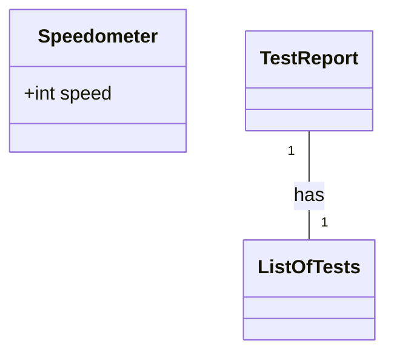
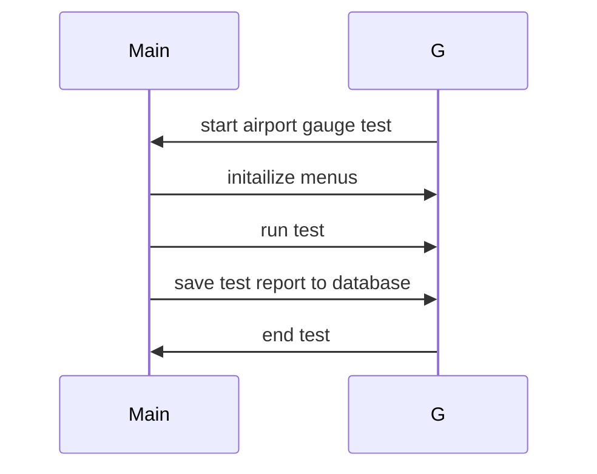

# Your Role
Act as an expert iOS(Swift) and Android(Java) Developer.  You specialize in writing Product Requirement Documents for iOS Developers using Java source code as your guide.

# Your Task
Please analyze all of the attached Java code.  Pay attention to what this code does for the system that the gauge is being used for.  Think about all of the features that an iOS project would have to completely replicate what the Java code is doing in the Android device.

---
# The following is a format example of what your output should be
---

## Implementation approach
- We are going to use the following sutable open source tools ...
- The challenges posed by the requirements are ...

## Swift Package Name
```swift
"airport_gauge_test"
```

## File List
```swift
[
    "speedometer.swift",
    "mysqldatabase.swift",
]
```

## Data Structures and Interface Definitions


## Program Call Flow
