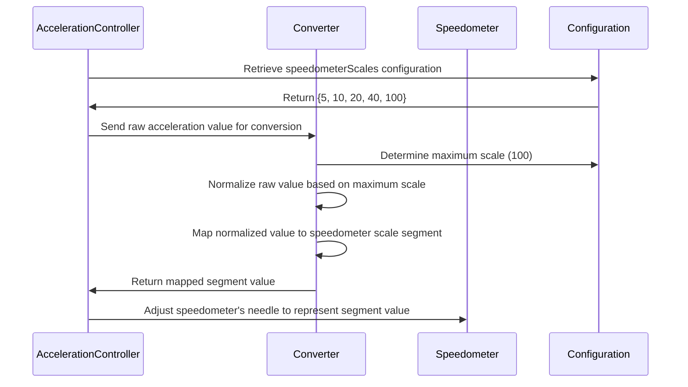

```mermaid
sequenceDiagram
    participant AC as AccelerationController
    participant C as Converter
    participant S as Speedometer
    participant Config as Configuration

    AC->>Config: Retrieve speedometerScales configuration
    Config->>AC: Return {5, 10, 20, 40, 100}
    AC->>C: Send raw acceleration value for conversion
    C->>Config: Determine maximum scale (100)
    C->>C: Normalize raw value based on maximum scale
    C->>C: Map normalized value to speedometer scale segment
    C->>AC: Return mapped segment value
    AC->>S: Adjust speedometer's needle to represent segment value
```