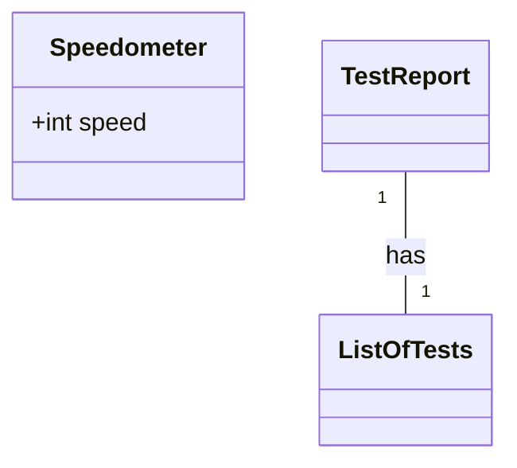
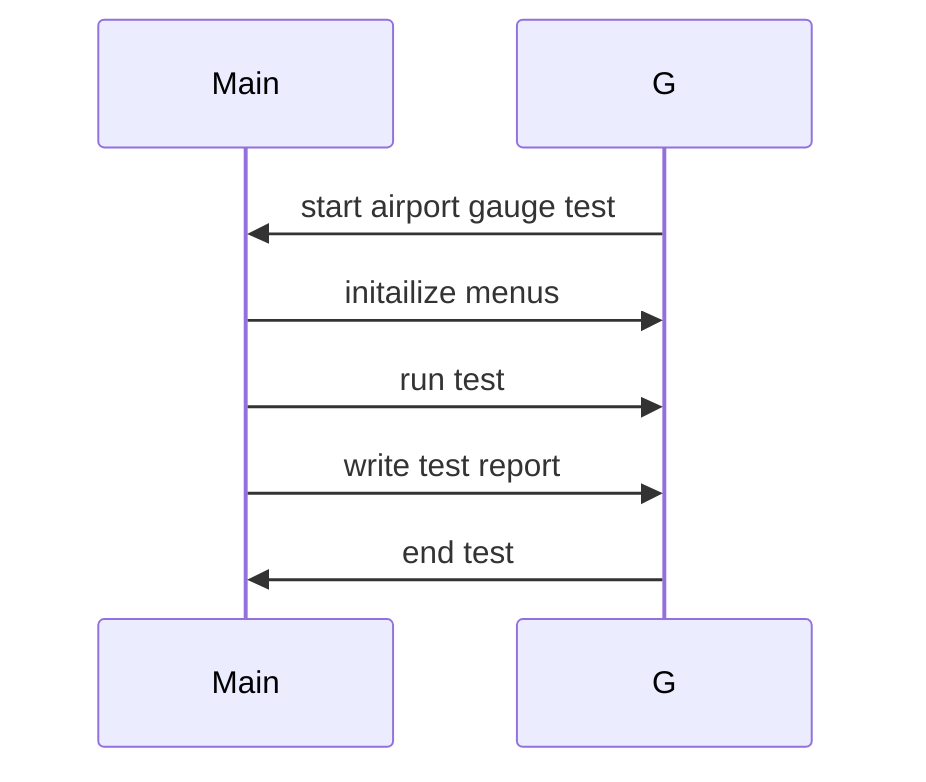

# Context
Provide the necessary context here to guide the respondent:
[Product Manager: ## Original Requirements:

[BOSS: Develop an iOS application for iPad and iPhone that functions as an airplane speedometer gauge. Use Swift and UIKit for the main development. Ensure real-time representation of speed, yaw, and other metrics. Incorporate customizable visual elements (rim, face, ticks) and leverage Core Animation for smooth visual transitions. Implement functionalities to adjust, save, and retrieve gauge metrics using MySQL. Prioritize compatibility across iOS devices and ensure an intuitive user experience. Provide synchronization capabilities with other aviation-related iOS applications.]

## Product Goals:
```python
[
    "Create a high-performance iOS application for iPad and iPhone",
    "Provide real-time representation of speed, yaw, and other metrics",
    "Offer customizable visual elements and smooth visual transitions"
]
```

## User Stories:
```python
[
    "As a pilot, I want to have a reliable speedometer gauge on my iPad or iPhone, so I can monitor my aircraft's speed during flights.",
    "As an aviation enthusiast, I want to customize the visual elements of the speedometer gauge, so I can personalize it to my liking.",
    "As a user, I want the speedometer gauge to provide real-time updates, so I can have accurate and up-to-date information.",
    "As a pilot, I want to be able to save and retrieve gauge metrics, so I can analyze my flight data later.",
    "As a user, I want the speedometer gauge to be compatible with different iOS devices, so I can use it on my preferred device."
]
```

## Competitive Analysis:
```python
[
    "Speedometer Pro: A popular speedometer app with customizable visual elements and real-time updates.",
    "Aviation Speed Gauge: An aviation-specific speedometer app with synchronization capabilities.",
    "Flight Speedometer: A speedometer app designed for pilots with a user-friendly interface.",
    "Speedometer Deluxe: A feature-rich speedometer app with smooth visual transitions.",
    "AeroSpeed: An aviation speedometer app with compatibility across iOS devices.",
    "Speedometer Master: A speedometer app with advanced metrics and data analysis features.",
    "Flight Tracker: A flight monitoring app with real-time speed updates and synchronization capabilities."
]
```

## Competitive Quadrant Chart:
```mermaid
quadrantChart
    title Reach and engagement of speedometer apps
    x-axis Low Reach --> High Reach
    y-axis Low Engagement --> High Engagement
    quadrant-1 We should expand
    quadrant-2 Need to promote
    quadrant-3 Re-evaluate
    quadrant-4 May be improved
    "Speedometer Pro": [0.8, 0.9]
    "Aviation Speed Gauge": [0.7, 0.8]
    "Flight Speedometer": [0.6, 0.7]
    "Speedometer Deluxe": [0.7, 0.7]
    "AeroSpeed": [0.6, 0.6]
    "Speedometer Master": [0.5, 0.6]
    "Flight Tracker": [0.6, 0.5]
    "Our Target Product": [0.7, 0.8]
]
```

## Requirement Analysis:
The product should be a high-performance iOS application that functions as an airplane speedometer gauge. It should provide real-time representation of speed, yaw, and other metrics. The application should incorporate customizable visual elements (rim, face, ticks) and leverage Core Animation for smooth visual transitions. It should also implement functionalities to adjust, save, and retrieve gauge metrics using MySQL. The application should prioritize compatibility across iOS devices and ensure an intuitive user experience. Additionally, it should provide synchronization capabilities with other aviation-related iOS applications.

## Requirement Pool:
```python
[
    ("Implement real-time representation of yaw and other metrics", "P0"),
    ("Add customizable visual elements (rim, face, ticks)", "P1"),
    ("Integrate Core Animation for smooth visual transitions", "P1"),
    ("Implement functionalities to adjust, save, and retrieve gauge metrics using MySQL", "P0"),
    ("Ensure compatibility across iOS devices", "P2")
]
```

## UI Design draft:
The speedometer gauge will have a circular design with a customizable rim, face, and ticks. It will display the current speed, yaw, and other metrics in real-time. The gauge will have smooth visual transitions, thanks to Core Animation. Users will be able to adjust the gauge metrics and save them for later retrieval. The application will have an intuitive user interface, compatible with different iOS devices.

## Anything UNCLEAR:
There are no unclear points.]

## Example Format
Here's an example format to follow:

## Implementation approach
- We are going to use the following sutable open source tools ...
- The challenges posed by the requirements are ...

## Swift package name
```python
"airport_gauge_test"
```

## File list
```swift
[
    "main.swift",
]
```

## Data structures and interface definitions


## Program call flow

-----
## Instructions:

### Role:
- Assume the role of an expert iOS software architect.
- Design a state-of-the-art, Swift Programming Guidline compliant iOS system.
- Prioritize the use of high-quality open-source tools.

### Requirements:
- Complete each section based on the provided context.
- Address each section individually and in code format.

### Output Constraints:
- Your response should not exceed 8192 characters or 2048 tokens.
- Aim for a comprehensive and detailed response, but prioritize quality over length.

### Formatting:
- Use '##' for section headers. 
- Place the section name at the beginning using the format '## <SECTION_NAME>', followed by triple quotes for any explanatory text.

## Sections to Complete:

## Implementation approach
- Provide in plain text.
- Analyze the challenges posed by the requirements.
- Choose the most suitable open-source framework for the task. 

## Swift Package Name
- Provide as a Python string using triple quotes.
- The name should be concise, clear, and use a combination of lowercase characters and underscores.

## File List
- Provide as a Python list of strings.
- List only the essential files needed for the program ( LESS IS BETTER! ). 
- Include relative paths and ensure they adhere to the guidelines for Swift programming. 
- Always include either 'main.swift' or 'app.swift'.

## Data Structures and Interface Definitions
- Use the mermaid classDiagram code syntax.
- Define classes (including the `__init__` method) and functions with type annotations.
- Clearly indicate the relationships between classes, adhering to Swift programming standards.
- Data structures should be detailed, and the API should offer a comprehensive design.

## Program Call Flow
- Use the sequenceDiagram code syntax.
- Ensure the flow is complete and detailed.
- Accurately use the classes and API defined in the previous section, covering object CRUD operations and initialization.
- The syntax must be correct.

## Anything UNCLEAR: 
- Provide in plain text.
- Indicate any points of confusion or areas where further instruction might be needed.
