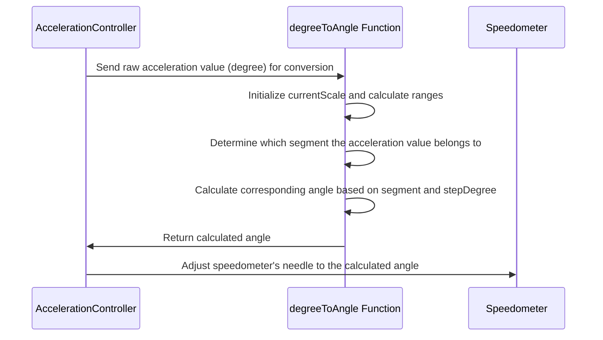

```mermaid
sequenceDiagram
    participant AC as AccelerationController
    participant DTA as degreeToAngle Function
    participant S as Speedometer

    AC->>DTA: Send raw acceleration value (degree) for conversion
    DTA->>DTA: Initialize currentScale and calculate ranges
    DTA->>DTA: Determine which segment the acceleration value belongs to
    DTA->>DTA: Calculate corresponding angle based on segment and stepDegree
    DTA->>AC: Return calculated angle
    AC->>S: Adjust speedometer's needle to the calculated angle
```